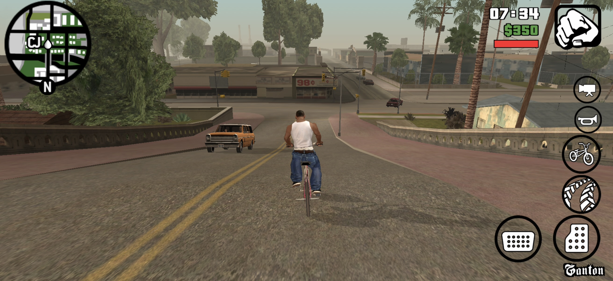
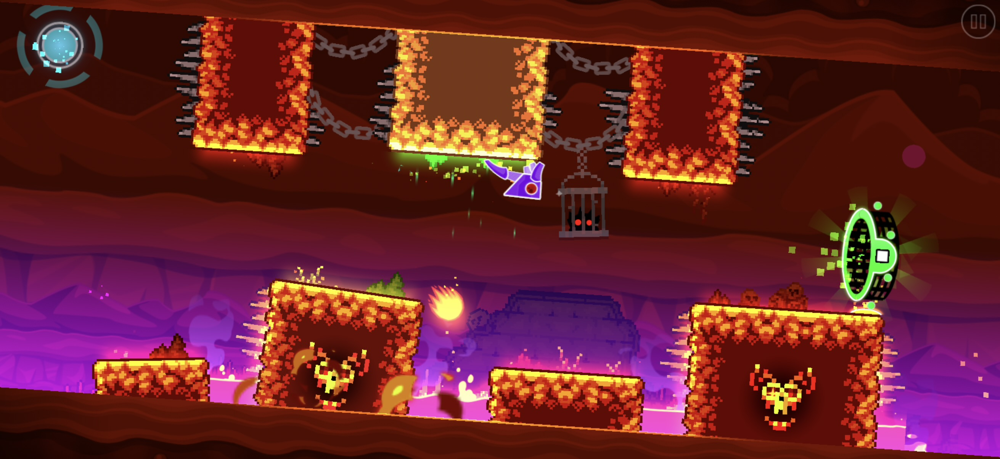
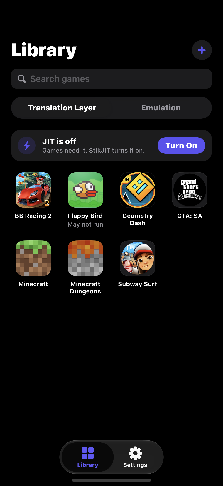
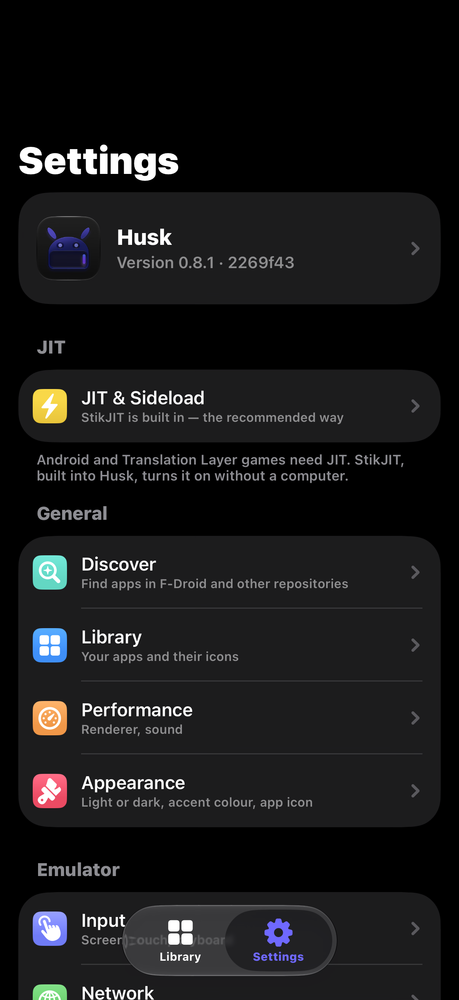

# Husk

<p align="center">
  <a href="https://trendshift.io/repositories/233057?utm_source=trendshift-badge&amp;utm_medium=badge&amp;utm_campaign=badge-trendshift-233057" target="_blank" rel="noopener noreferrer">
    
  </a>
</p>

[](https://github.com/leviidev/husk/releases)

Android apps and games on your iPhone.

Add an APK, tap it, and it opens full-screen. Husk runs it in one of two ways,
shown as the two sides of its Library:

- **Translation Layer.** The game's own 64-bit Android code runs directly on
  the iPhone's processor, and Husk stands in for Android around it: the C
  library, the Java calls the game makes, OpenGL ES (through ANGLE), Vulkan
  (through MoltenVK), sound, touch and controllers. No Android boots, so a
  game starts in seconds, and its code is never emulated.
  See [docs/04-translation-layer.md](docs/04-translation-layer.md).
- **Emulation.** A full Android system (LineageOS) boots under QEMU inside
  Husk, for apps the translation layer cannot run yet and for using Android
  itself. iOS gives apps no hypervisor, so the processor is emulated, and
  this is much slower than the translation layer.
  See [docs/00-architecture.md](docs/00-architecture.md).

## Screenshots

### Games on the Translation Layer

<table>
  <tr>
    <td align="center"><br><sub><b>GTA: San Andreas</b></sub></td>
    <td align="center"><br><sub><b>Minecraft Dungeons</b></sub></td>
  </tr>
  <tr>
    <td align="center"><br><sub><b>Beach Buggy Racing 2</b></sub></td>
    <td align="center"><br><sub><b>Geometry Dash</b></sub></td>
  </tr>
</table>

### The app

<table>
  <tr>
    <td align="center" width="33%"><br><sub><b>Library</b></sub></td>
    <td align="center" width="33%"><br><sub><b>Game Settings</b></sub></td>
    <td align="center" width="33%"><br><sub><b>Settings</b></sub></td>
  </tr>
</table>

## What the Translation Layer runs

Games made with an engine Husk has a driver for:

- Unity
- Unreal Engine 4 (through Vulkan)
- cocos2d-x
- Godot 3 and 4 (GLES2, GLES3 and the Compatibility renderer)
- SDL2 and SDL3, including LÖVE games
- GameActivity (Minecraft) and NativeActivity
- Rockstar's own engine (GTA: San Andreas)

Games see Google Play services as installed and signed out, so the ones that
check for it start normally; Play Games sign-in, cloud saves and purchases are
not available. Geometry Dash can load [Geode](https://geode-sdk.org) mods.

An APK needs 64-bit (`arm64-v8a`) native code. iPhones cannot run 32-bit ARM
code, so an APK that only has 32-bit libraries cannot run here. APKs and
split bundles (`.xapk`, `.apkm`, `.apks`, or a Play download's separate split
APKs and asset packs) can all be added. Apps written only
in Java, with no native engine, are not supported on the translation layer;
Emulation is the way to run those.

One game runs per launch of Husk. To switch, press **Close Husk to Play** on
the other game's page; when you open Husk again, that game starts by itself.

A game's saves can be backed up to a `.zip` from its page and restored later,
on the same iPhone or another. If a game crashes Husk, the next launch shows
what happened, with a report you can share.

## Installing

**SideStore, AltStore and other sideloaders:** add Husk's source, and the
sideloader installs Husk and offers each update as it comes out.

```
https://raw.githubusercontent.com/Leviidev/Husk/main/altsource.json
```

In SideStore or AltStore: Sources › + › paste the address above.

**Or by hand:** download `Husk.ipa` from
[Releases](https://github.com/leviidev/husk/releases) and install it with
SideStore, AltStore or TrollStore. It is one IPA for all of them: it carries
Husk's entitlements, which TrollStore keeps, and a sideloader re-signs it with
your own.

Husk needs iOS 16.0 or later.

## JIT

Both the translation layer and Emulation need JIT, which on iOS comes from a
debugger. Husk can get it in several ways, and walks you through each one
(Settings › JIT & Sideload):

- **Built-in StikJIT** (iOS 26 and later): Husk turns JIT on itself, with no
  second app. On iOS 27 it pairs with your iPhone from Settings, with no
  computer. See [docs/06-built-in-jit.md](docs/06-built-in-jit.md).
- **StikDebug**, installed alongside Husk.
- **TrollStore or a Dopamine jailbreak** ("Allow JIT in Apps"), on iOS
  versions before 26 only. From iOS 26 only a debugger can grant JIT.

## Building

Husk is built on a Mac with Xcode. The build scripts also call `meson`,
`ninja`, `pkg-config`, `python3`, `xcodegen`, `qemu-img` and a Rust
toolchain with the `aarch64-apple-ios` target.

```sh
./scripts/ci_build.sh
```

From a clean checkout this fetches and cross-compiles everything Husk links:

- QEMU and its dependencies
- ANGLE and virglrenderer
- MoltenVK
- the on-device pairing library

It then builds the app and writes the IPA to `build/Husk.ipa`. The first run
takes a couple of hours, and later runs reuse what is already built. After
that, `./scripts/package_ipa.sh` rebuilds just the app and writes
`~/Desktop/Husk.ipa`.

`tools/regress/run.sh` plays a set of games on the Mac through the
translation layer and checks each against a reference screenshot (see the
top of `tools/regress/cases.txt` for what it needs).

## Licence

GPL-2.0-or-later. Husk links QEMU, which is GPLv2, so the shipped binary is a
combined GPLv2 work and the full source is public. The translation layer is
Husk's own code, under the same licence. Husk cannot go on the App Store, both
because of that and because it needs `get-task-allow` plus a debugger
attaching at runtime. See [docs/01-licensing.md](docs/01-licensing.md).
